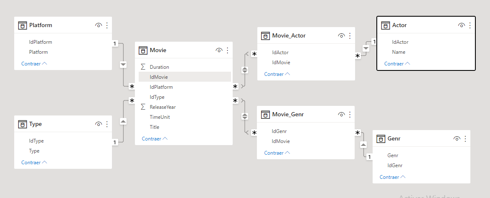

# Data Engineering

## Proyecto Individual No 1 -Data 05- Soy Henry
# 
### Armando Madrigal Lucatero
 
 

## Introducción
El presente trabajo está basado en el rol de un **Data Engineer**. El proyecto consiste en realizar una ingesta de datos desde diversas fuentes, posteriormente aplicar las transformaciones que se consideren pertinentes, y luego disponibilizar los datos limpios para su consulta a través de una API.

## Extracción, transformación y carga (ETL)

* Se realizó la extracción de información a partir de archivos provistos en formato csv y json.
* La transformación y limpieza de datos se realizó utilizando las bibliotecas Pandas y Numpy.
* Se hizo un análisis exploratorio de datos para decidir cuáles de ellos eran relevantes para responder las preguntas de negocio planteadas.
* Posteriormente se hizo una limpieza de datos para prepararlos antes de su almacenamiento en forma estructurada.
* Una vez estructurados los datos se realizaron las consultas de interés para el negocio.

## Modelo de datos relacional

* Con la finalidad de facilitar y optimizar las consultas de datos se creó una base de datos relacional en MySQL, donde se cargaron los datos de forma estructurada.
* Se establecieron las claves primarias y foráneas para relacionar las diferentes tablas del modelo. En la imagen siguiente se muestra la estructura del modelo de datos.
* El modelo de base de datos utilizado es un esquema copo de nieve.

## Preguntas de negocio

Las consultas relacionadas con el negocio que se realizaron son:

* Máxima duración según tipo de film (película/serie), por plataforma y por año: El request utilizado es: get_max_duration(año, plataforma, [min o season])

* Cantidad de películas y series (separado) por plataforma El request utilizado es: get_count_plataform(plataforma)

* Cantidad de veces que se repite un género y plataforma con mayor frecuencia del mismo. El request utilizado es: get_listedin('genero')

* Actor que más se repite según plataforma y año. El request utilizado es: get_actor(plataforma, año)

## Implementación de una API
* Para la implementación de esta API se utilizó la Python y su biblioteca FastApi.
* Para conectar la API con la base de datos se utilizó MySQL por medio de la biblioteca PyMysql. 
* La API consiste en una aplicación que internamente realiza consultas en lenguaje SQL y nos trae la información requerida en base a ciertos parámetros proporcionados por el usuario. 

## Descripción de archivos y directorios
* El directorio `Dataset` contiene archivos csv y json con los datos sin procesar
* El notebook `EDA.ipynb` contiene un análisis exploratorio de los datos, así como una limpieza de ello. También se estructuro la data en tablas para posteriormente ser cargadas al modelo relacional. Estas tabas se guardaron en archivos csv en el directorio `Tablas`.
* En el notebook `create_DB.ipynb` se realiza la creación de la base de datos y la ingesta de datos a partir de los archivos guardados en el directorio `Tablas`.
* El archivo `queries.sql` contiene código SQL con el cual se realizan las consultas solicitadas.
* Finalmente, en el directorio `App` se encuentra el código de la API, el archivo `app.py` corre la aplicación; y el archivo `queries.py` realiza las consultas a la base de datos.

## Documentación

* FastAPI https://fastapi.tiangolo.com/
* Numpy https://numpy.org/doc/stable/
* Pandas https://pandas.pydata.org/
* PyMySQL https://pypi.org/project/PyMySQL/
* Unicodedata https://docs.python.org/3/library/unicodedata.html

